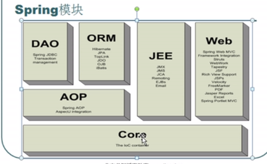

java学习的好网站

http://how2j.cn/


blibli学习视频：

https://www.bilibili.com/video/av13109807/?p=1

https://www.bilibili.com/video/av15036648/?spm_id_from=333.788.videocard.0


https://www.bilibili.com/video/av38516969/

https://www.bilibili.com/video/av38356979/


https://www.bilibili.com/video/av22544150/?spm_id_from=333.788.videocard.17

https://www.bilibili.com/video/av27209155/?p=24

<https://www.bilibili.com/video/av45967937/?spm_id_from=333.788.videocard.12>

<https://www.bilibili.com/video/av38376991/?spm_id_from=333.788.videocard.2>


使用eclipse：

​         xml 文件当中 class导入包路径的补全（help下的，安装spring的工具即可）


## 一、明白spring的作用：


	基于传统的mvc的开发模式
	都使用方法来进行封装
	1、实体层（model）
	2、dao
	3、service
	4、action
	
	用户访问：user action  --->tomcat (action,service,dao)
	
	   1、对象的创建是不能写死的（怎么处理呢）配置文件
	   2、对象创建的细节
	   对象数量    
		
		   action 是多个的（web项目是并发访问的，维护成员变量）
		   service  创建一个就可以『不需要维护公共的变量』
		   dao 创建一个  『不需要维护公共的变量』
		
		创建的时间
		
		  action 是在访问的时候进行创建的
		  service 启动的时候创建的
		  dao  启动的时候创建的
	3、对象的依赖关系
	
	    action 依赖 service
	   
	    service 依赖 dao
	    
	+++++++++++++++++++++++++++++++++++++++++++++++++++++++++++++
	spring是处理对象的创建，以及对象的依赖关系（使得对象不再是写死的了）


## 二、专业术语，侵入式设计与非侵入式设计（Hibernate框架/spring框架） 

```
1、组件/框架设计：
      侵入式设计  struts框架：
	  引入了框架对现有的类 的结构有影响，就是需要实现或者继承某些特定的类 非侵入式设计（这个方式更好） Hibernate框架/spring框架
   
       引入后，不需要对现有的类结构没有影响

2、控制反转： IOC
   inversion on control，控制反转 ----->对象关系处理：  依赖注入
   将对象的创建交给别人，就是控制反转 
   需要什么就，创建什么 -->”控制正转“
```


```
控制反转解决对象创建的问题{把对象的创建交给别人}

依赖注入，创建完对象后，对象的关系的处理就是依赖注入{通过set方法依赖注入}

3、AOP面向切面编程
切面，由很多重复代码形成的类
eg：事务，增删改查
    日志
    权限

```


## 三、spring框架的核心（IOC容器）

 spring的模块构成：



- 概述：可以解决对象创建以及对象之间的依赖关系的一种框架，且可以和其他的框架一起使用（兼容性好）
         eg：struts ，hibernate
            起到整合、粘合作用的框架  

          spring 提供一站式解决方案，可以把市面的主流框架整合进来
                    1）spring core  ：spring的核心功能，IOC（控制反转）容器，解决对象创建和依赖关系
            
                    2）spring web spring对web模块的支持。
            
                                                            可以和struts整合，让struts的action创建交给spring
            
                                                            spring mvc（可以取代struts）
            
                    3）spring dao    spring对jdbc 操作的支持 {jdbcTemplate模板工具类}
            
                    4）spring orm    spring 对orm的支持：既可以和hibernate整合也可以使用spring对                                 hibernate操作的封装
            
                    5）spring AOP 切面编程
            
                    6）SpringEE     spring 对 javaEE其他的模块的支持
     
- 开发步骤

- 注意：在spring各个版本中：

-            在3.0以下的版本，源码有spring中相关的所有包【spring功能+依赖包】eg 2.5版本的

-            在3.0以上的版本中，源码只有spring的核心功能包，没有依赖包了

-           （3.0以上如果要使用依赖包就要下载，自己引入）

  

###   1、源码，jar文件：到官网下载源码release（不需要全部引入，先把基本的引入，其他的在根据需要引入）

  ```
             日志的：jakarta，
    
             jar：spring-beans  ，spring-core   ，spring-expression，spring-aop，                         spring-context ，commons-logging（3.0以上单独下载并引入）
  ```

  单独spring框架下是没有日志的jar包的，commons-logging

  引入核心jar包

  spring-core\commons-logging-1.2.jar
  spring-core\spring-beans-5.1.8.RELEASE.jar
  spring-core\spring-beans-5.1.8.RELEASE-sources.jar
  spring-core\spring-context-5.1.8.RELEASE.jar
  spring-core\spring-context-5.1.8.RELEASE-sources.jar
  spring-core\spring-core-5.1.8.RELEASE.jar
  spring-core\spring-core-5.1.8.RELEASE-sources.jar
  spring-core\spring-expression-5.1.8.RELEASE.jar
  spring-core\spring-expression-5.1.8.RELEASE-sources.jar

  

  项目导入报错：引用的库找不到（删除库/添加对应的库）

  

  （新建用户库进行管理）user library

  除了创建一个文件夹来存jar之外，还可以项目右键build path new创建一个 user library

  注意，1）这个方式将项目文件导出来是没有jar包的，所以，每次导入项目的时候都要将项目的

  user library  移除掉然后，重建在添加

  ​            2）发布的时候，注意jar发布到tomcat下

  

  

  

  

### 2、核心配置文件，applicationContext.xml

  ​        spring配置文件：applicationContext.xml/bean.xml

  ​        约束（结点）：（怎么写约束）（1、在框架的源码当中寻找（在3.0以上是找不到现成的约束的），）

  

  

  ```xml
 <!-- 约束文件尽可能简洁，需要什么加什么，不然，可能会出现问题 -->

<?xml version="1.0" encoding="UTF-8"?>
<beans xmlns="http://www.springframework.org/schema/beans"
    xmlns:xsi="http://www.w3.org/2001/XMLSchema-instance"
	xmlns:p="http://www.springframework.org/schema/p"
    xmlns:context="http://www.springframework.org/schema/context"
    xsi:schemaLocation="
        http://www.springframework.org/schema/beans
        https://www.springframework.org/schema/beans/spring-beans.xsd
        http://www.springframework.org/schema/context
        https://www.springframework.org/schema/context/spring-context.xsd">
  
   <!-- IOC容器的配置：要创建的所有的对象都配置在这里 -->
    <bean id="user" class="hello.user" scope="singleton"></bean>
    <!--对象的创建，单例/多例   默认是单例子 scope="singleton" -->
    
    <bean id="user" class="hello.user" scope="prototype"></bean>
<!--对象的创建，多例 默认是单例子，所以一定要写上，单例倒是可以不写  scope="prototype"  -->

</beans>
  
  ```

  ```java
package hello;

import org.junit.Test;
import org.springframework.beans.factory.BeanFactory;
import org.springframework.beans.factory.xml.XmlBeanFactory;
import org.springframework.context.ApplicationContext;
import org.springframework.context.support.ClassPathXmlApplicationContext;
import org.springframework.core.io.ClassPathResource;
import org.springframework.core.io.Resource;

@SuppressWarnings("deprecation")
public class app {

	// 1.通过工厂类得到容器创建的对象
	@Test
	public void testIOC() throws Exception {
		// 创建对象
		// User user = new User();
		// 现在，把对象的创建交给spring的容器

		/// 注意 import的包要正确才行
		Resource resource = new ClassPathResource("hello/applicationContext.xml");

		BeanFactory factory = new XmlBeanFactory(resource);
		user user = (user) factory.getBean("user");
		System.err.println(user.getId());

	}

//	2、比较方便的方法：直接得到IOC容器对象
	@Test
	public void testAC() throws Exception {
		// 得到IOC容器对象

ApplicationContext ac = new                        ClassPathXmlApplicationContext("hello/applicationContext.xml");

		// 从容器中获取bean
		user user = (user) ac.getBean("user");
		System.err.println(user.getId());

	}

}

  ```

 测试的项目结构：  

  

### 3、bean创建的细节（service/action Set依赖注入-->beans（ioc容器）--->bean创建ioc对象并处理对象的依赖关系）

****


```xml
 <!-- IOC容器的配置：要创建的所有的对象都配置在这里 -->
    <bean id="user" class="hello.user" scope="singleton"></bean>
    <!--对象的创建，单例/多例 默认是单例子   scope="singleton"  -->
 <bean id="user" class="hello.user" scope="prototype" lazy-init="default"></bean>
<!-- 只对singleton 有效
lazy-init="default"
 false 不延迟创建，一启动就创建
 true  延迟创建，使用到的时候才进行创建
-->

<bean id="user" class="hello.user" scope="prototype"></bean>
<!--对象的创建，多例 默认是单例子，所以一定要写上，单例倒是可以不写  scope="prototype"  -->
<!--注意：
	/**
	 * 1、对象的创建，单例/多例          
	 * 默认是单例子 scope="singleton"  创建的对象【service/dao/工具类】 只创建一次
	 * 多例 scope="prototype"  创建对象【action】                    每次都会创建
	   2、什么时候创建呢？
	   单例：一开始（容器初始化前）就创建了bean对象，使用时就没创建而是直接调用
	   多例：使用时才创建bean对象
	 *
	 */-->

<bean id="user" class="hello.user" scope="singleton" init-method="init" destroy-method="destroy" lazy-init="default"></bean>
<!-- 
    nit-method="init" destroy-method="destroy" 
-->
```

```java
package bean;

import org.junit.Test;
import org.springframework.context.ApplicationContext;
import org.springframework.context.support.ClassPathXmlApplicationContext;

import hello.user;

public class app_get_ioc {
	// 得到IOC容器对象
	private ApplicationContext ac = new ClassPathXmlApplicationContext("hello/applicationContext.xml");

	/**
	 * 1、对象的创建，单例/多例
	 * 默认是单例子
	 *   <bean id="user" class="hello.user" scope="singleton"></bean>
	 */
	@Test
	public void testAC() throws Exception {
		

		// 从容器中获取bean
		user user1 = (user) ac.getBean("user");
		user user2 = (user) ac.getBean("user");
		System.err.println(user1.getId());
		System.err.println(user2.getId());

	}
}
```

demo的项目文件结构部分截图：


```java
package bean;

import org.junit.Test;
import org.springframework.context.ApplicationContext;
import org.springframework.context.support.ClassPathXmlApplicationContext;

import hello.user;

public class app_get_ioc {
	// 得到IOC容器对象
	//	private ApplicationContext ac = new ClassPathXmlApplicationContext("hello/applicationContext.xml");
	private ClassPathXmlApplicationContext ac = new ClassPathXmlApplicationContext("hello/applicationContext.xml");


	/**
	 * 1、对象的创建，单例/多例          
	 * 默认是单例子 scope="singleton"  创建的对象【service/dao/工具类】 只创建一次
	 * 多例 scope="prototype"  创建对象【action】                    每次都会创建
	   2、什么时候创建呢？
	   单例：一开始（容器初始化前）就创建了bean对象，使用时就没创建而是直接调用
	   多例：使用时才创建bean对象
	 * 3、是否延迟创建（只对singleton有效）
	      lazy-init="default"
	      false 不延迟创建，一启动就创建
	      true  延迟创建，使用到的时候才进行创建
	             
	   servlet（init（初始化）/service/destroy（销毁））  
        4、创建对象之后，初始化\销毁
        init-method="init"  【对应对象的init初始化方法，在对象创建之后执行】
        destroy-method="destroy" 【在调用容器对象的destroy方法时候执行，容器用实现类                                                                              ac.destroy();】
        private ClassPathXmlApplicationContext ac = new ClassPathXmlApplicationContext("hello/applicationContext.xml");
       
       ac.destroy();
	 */
	@Test
	public void testAC() throws Exception {
		
        System.err.println("容器创建成功");
		// 从容器中获取bean
		user user1 = (user) ac.getBean("user");
		user user2 = (user) ac.getBean("user");
		System.err.println(user1.getId());
		System.err.println(user2.getId());

        //销毁容器对象
		ac.destroy();
	}
}
/*
console：
       singleton
       user对象已经创建
          容器创建成功
                   0
                   0
                   
                   
       调用init，destroy方法
       
       <bean id="user" class="hello.user" scope="singleton" init-method="init" destroy-method="destroy" lazy-init="default"></bean>
       <!--     nit-method="init" destroy-method="destroy" -->
       
       user对象已经创建
       创建对象后初始化
       容器创建成功
       hello.user@4efbca5a
       hello.user@4efbca5a
       IOC容器销毁，user对象回收
       
 /////////////////////////////////     
       prototype
        容器创建成功
        user对象已经创建
        user对象已经创建
                   0
                   0
*/
```


### 4、IOC容器，创建对象（springIOC 容器）

####     **1）创建对象：**

  spring IOC容器，是spring核心内容

​      作用：创建对象 & 处理对象的依赖关系

​       容器创建对象：

​               创建对象的几种方法

​                1）调用无参数构造方法

​                2）带参数构造方法

​                3）工厂创建对象

​                                        工厂类，静态方法创建对象

​                                        工厂类，非静态方法创建对象


demo的项目结构：

```xml
<?xml version="1.0" encoding="UTF-8"?>
<beans xmlns="http://www.springframework.org/schema/beans"
	xmlns:xsi="http://www.w3.org/2001/XMLSchema-instance"
	xmlns:p="http://www.springframework.org/schema/p"
	xmlns:context="http://www.springframework.org/schema/context"
	xsi:schemaLocation="
        http://www.springframework.org/schema/beans
        https://www.springframework.org/schema/beans/spring-beans.xsd
        http://www.springframework.org/schema/context
        https://www.springframework.org/schema/context/spring-context.xsd">

	<!-- 对象创建 -->

	<!--注意，id不能重复 -->

	<!-- 1、默认的无参数的构造方法 -->
	<bean id="user1" class="create_obj.user"></bean>
	<!-- 2、带参数的构造方法 -->
	<bean id="user2" class="create_obj.user">
		<!--子节点 index -->
		<constructor-arg index="0" type="int" value="100">
		</constructor-arg>
		<constructor-arg index="1" type="String" value="ldx"></constructor-arg>

	</bean>

	<!-- 3、创建一个字符串对象，值为jack ；String s = new String（“jack”） -->
	<bean id="str" class="java.lang.String">
		<constructor-arg value="jack"></constructor-arg>
	</bean>

	<bean id="user3" class="create_obj.user">
		<!--子节点 index -->
		<constructor-arg index="0" type="int" value="100">
		</constructor-arg>
		<constructor-arg index="1" type="java.lang.String" ref="str"></constructor-arg>

	</bean>
	<!-- 工厂类创建对象   -->
	<!-- #工厂类 实例方法 -->
	<!-- 先创建工厂 -->
	<!-- factory-bean="factory" 引用工厂对象 -->
	<bean id="factory" class="create_obj.userFactory"></bean>
	<!-- 在创建的user对象，用factory方法返回值 -->
	<bean id="user4" factory-bean="factory" factory-method="getUserInstace"></bean>
	
	<!-- #工厂类 静态方法 -->
	<!-- class 指定的就是工厂的类型 
	     factory-method 指定工厂里面的静态方法
	-->
    <bean id="user5" class="create_obj.userFactory" factory-method="getUserStaticInstace"></bean>

</beans>

```

```java
package create_obj;
import org.junit.Test;
import org.springframework.context.ApplicationContext;
import org.springframework.context.support.ClassPathXmlApplicationContext;

public class app {
	// 创建容器对象
	private ApplicationContext ac = new ClassPathXmlApplicationContext("create_obj/bean.xml");

	@Test
	public void testIOC() throws Exception {
		// 获取容器中的对象

		user user1 = (user) ac.getBean("user1");

		user user2 = (user) ac.getBean("user2");

		user user3 = (user) ac.getBean("user3");

		user user4 = (user) ac.getBean("user4");
		user user5 = (user) ac.getBean("user5");

		System.out.println(user2);
		System.out.println(user2);
		System.out.println(user3);
		System.out.println(user4);
		System.out.println(user5);
	}
}

```

```java
package create_obj;

import org.junit.jupiter.api.Test;

public class user {

	@Override
	public String toString() {
		return "user [id=" + id + ", name=" + name + "]";
	}

	private int id;
	private String name;

	public user() {
		super();
		System.out.println("user对象已经创建[无参数构造方法]");
	}
	
	public user(int id, String name) {
		System.out.println("user对象已经创建[有参数构造方法]");
		
		this.id = id;
		this.name = name;
	}

	public int getId() {
		return id;
	}

	public void setId(int id) {
		this.id = id;
	}

	public String getName() {
		return name;
	}

	public void setName(String name) {
		this.name = name;
	}

	public void init() {
             System.err.println("创建对象后初始化");
	}

	public void destroy() {
              System.out.println("IOC容器销毁，user对象回收");
	}

}
```

```java
package create_obj;

public class userFactory {

	public user getUserInstace() {
		return new user(100, "工厂：调用实例方法");
	}

	public static user getUserStaticInstace() {
		return new user(101, "工厂：调用静态方法");
	}

}  
```

#### 2）DI，对象的依赖关系的处理：XML配置（IOC配置）、注解（两种可以一起使用Id名称可以相同）

​       如何给对象的属性赋值？【DI,依赖注入】

​             1、构造方法

​             2、通set方法给属性注入值

​            （3---5对1、2的优化）

​             3、p名称空间

​             4、自动装配

​             5、注解

demo项目的文件结构：


##### 1。构造方法

##### 2。通set方法给属性注入值


bean.xml

```xml
<?xml version="1.0" encoding="UTF-8"?>
<beans xmlns="http://www.springframework.org/schema/beans"
	xmlns:xsi="http://www.w3.org/2001/XMLSchema-instance"
	xmlns:p="http://www.springframework.org/schema/p"  
	xmlns:context="http://www.springframework.org/schema/context"
	xsi:schemaLocation="
        http://www.springframework.org/schema/beans
        https://www.springframework.org/schema/beans/spring-beans.xsd
        http://www.springframework.org/schema/context
        https://www.springframework.org/schema/context/spring-context.xsd">


	<!-- spring IOC 控制反转容器的配置 -->

	<!-- 对象的创建交给容器来完成 -->

	<!-- 对象的属性赋值 -->
	<!-- 1、构造函数 -->
	<bean id="user1" class="property.user">
		<constructor-arg value="100"></constructor-arg>
		<constructor-arg value="Tom"></constructor-arg>
	</bean>

	<!-- 2、通过set方法给属性注入值 -->
	<bean id="user2" class="property.user">
		<property name="id" value="101"></property>
		<property name="name" value="jack"></property>
	</bean>
	
	
	<!--***************************作用相同的两种方法*****************************  -->

	<!-- （控制反转）IOC容器创建对象 3、怎么写service\dao\action set方法的依赖注入 -->

	<!-- dao instance -->
	<bean id="userDao" class="property.userDao"></bean>

	<!-- service instance -->
	<bean id="userService" class="property.userService">
		<!-- ref引用dao -->
		<property name="userDao" ref="userDao"></property>
	</bean>

	<!-- action instance -->
	<bean id="userAction" class="property.userAction">
		<property name="userService" ref="userService"></property>

	</bean>

<!--
              都创建了对象并处理了对象的依赖关系
***************************区别***************************** 
        内部bean的是在内部处理依赖的关系，所以，不能重复使用 对象
        每次都要重新写一下
     1、不能重复使用，
     2、不好维护。因为不好找哪里出错了
 -->

	<!-- 内部bean -->
	<bean id="userAction2" class="property.userAction">
		<property name="userService">
			<bean class="property.userService">
				<property name="userDao">
					<bean class="property.userDao">
					</bean>
				</property>
			</bean>
		</property>
	</bean>
<!--***************************作用相同的两种方法*****************************  -->
   <!--  引用 p名称空间 	xmlns:p="http://www.springframework.org/schema/p"    -->
   <!-- 给对象属性 注入值
        #  1、p名称空间给对象属性注入值（spring3.0以上的版本才行）
        
    -->
      <bean></bean>

</beans>

```


#####    3。p名称空间

bean_p.xml

```xml
<?xml version="1.0" encoding="UTF-8"?>
<beans xmlns="http://www.springframework.org/schema/beans"
	xmlns:xsi="http://www.w3.org/2001/XMLSchema-instance"
	xmlns:p="http://www.springframework.org/schema/p"
	xmlns:context="http://www.springframework.org/schema/context"
	xsi:schemaLocation="
        http://www.springframework.org/schema/beans
        https://www.springframework.org/schema/beans/spring-beans.xsd
        http://www.springframework.org/schema/context
        https://www.springframework.org/schema/context/spring-context.xsd">


	<!--***************************作用相同的两种方法***************************** -->
	<!-- 引用 p名称空间 xmlns:p="http://www.springframework.org/schema/p" -->
	<!--
	      
	       p名称空间进行优化
	 
	给对象属性 注入值 # 1、p名称空间给对象属性注入值（spring3.0以上的版本才行）
            p名称set 
-->
      
     <bean id="userDao" class="property.userDao"></bean>
	        
     <bean id="userService" class="property.userService" p:userDao-ref="userDao"></bean>

     <bean id="userAction" class="property.userAction" p:userService-ref="userService"></bean>
     
     
     

<!-- bean 创建对象 ， 使用对应的id 引入class路径 property （处理对象的依赖关系）进行依赖注入 -->

<!-- 传统的set方法注入 -->
	<bean id="userDao" class="property.userDao"></bean>

	<bean id="userService" class="property.userService">

		<!-- ref 引用 ref Id -->
		<property name="userDao" ref="userDao"></property>
	</bean>

	<bean id="userAction" class="property.userAction">
		<property name="userService" ref="userService"></property>
	</bean>
   
   
	<!--***************************作用相同的两种方法***************************** -->
       <bean id="user" class="property.user" p:name="jack"></bean>
       <!-- 等价于 -->
       <bean id="user" class="property.user">
		<property name="name" value="jack"></property>
	</bean>

</beans>

```

 

```java
package property;

import org.junit.Test;
import org.springframework.context.ApplicationContext;
import org.springframework.context.support.ClassPathXmlApplicationContext;

public class app_p {

	private ApplicationContext ac = new ClassPathXmlApplicationContext("property/bean_p.xml");

    @Test
     public void testSet() {
    	//从容器当中获取对象
    	user user1 = (user) ac.getBean("user1");
    	System.out.println(user1);
    	user user2 = (user) ac.getBean("user2");
    	System.out.println(user2);
    }
    @Test
     public void testExecuteAction() {
    	//从容器当中获取action
    	userAction userAction = (userAction) ac.getBean("userAction");	
    	userAction.execute();
    }
    
}

```

```java
package property;

import org.junit.Test;
import org.springframework.context.ApplicationContext;
import org.springframework.context.support.ClassPathXmlApplicationContext;

public class app {
	private ApplicationContext ac = new ClassPathXmlApplicationContext("property/bean.xml");
    @Test
     public void testExecuteAction() {
    	//从容器当中获取action
    	
    	userAction userAction = (userAction) ac.getBean("userAction2");
    	userAction.execute();
    }
}

```

```java
package property;


public class user {

	@Override
	public String toString() {
		return "user [id=" + id + ", name=" + name + "]";
	}

	private int id;
	private String name;

	public user() {
		super();
		System.out.println("user对象已经创建[无参数构造方法]");
	}
	
	public user(int id, String name) {
		System.out.println("user对象已经创建[有参数构造方法]");
		
		this.id = id;
		this.name = name;
	}

	public int getId() {
		return id;
	}

	public void setId(int id) {
		this.id = id;
	}

	public String getName() {
		return name;
	}

	public void setName(String name) {
		this.name = name;
	}

	public void init() {
             System.err.println("创建对象后初始化");
	}

	public void destroy() {
              System.out.println("IOC容器销毁，user对象回收");
	}

}
```

```java
package property;

public class userDao {
	
	public void save() {
		System.out.println("保存用户信息");
	}

}


package property;

public class userService {
	private userDao userDao;// =new userDao();
	// IOC：对象交给spring的外部容器完成

	
//	  set的依赖注入
	public void setUserDao(userDao userDao) {
		this.userDao = userDao;
	}
	
	public void save() {
		userDao.save();
	}

}

package property;

public class userAction {

	// service ：SpringIOC容器依赖注入

	private userService userService;

	
//	  set的依赖注入
	public void setUserService(userService userService) {
		this.userService = userService;
	}

	public userService getUserService() {
		return userService;
	}

	public String execute() {
		userService.save();
		return null;

	}
}

```

##### 4。自动装配（根据名称byname，根据类型bytype,实际开发当中为了让文档清晰所以不使用自动装配）

注意：根据类型自动装配，前提：确保IOC容器（xml-->beans）当中只有一个该类型的对象（不然，就没法使用）

•在 Bean 配置文件里设置autowire属性进行自动装配将会装配Bean的所有属性.然而,若只希望装配个别属性时,autowire属性就不够灵活了.
•autowire 属性要么根据类型自动装配,要么根据名称自动装配,不能两者兼而有之.

###### **•一般情况下，在实际的项目中很少使用自动装配功能，因为和自动装配功能所带来的好处比起来，明确清晰的配置文档更有说服力一些**


```xml
<?xml version="1.0" encoding="UTF-8"?>
<beans xmlns="http://www.springframework.org/schema/beans"
	xmlns:xsi="http://www.w3.org/2001/XMLSchema-instance"
	xmlns:p="http://www.springframework.org/schema/p"
	xmlns:context="http://www.springframework.org/schema/context"
	xsi:schemaLocation="
        http://www.springframework.org/schema/beans
        https://www.springframework.org/schema/beans/spring-beans.xsd
        http://www.springframework.org/schema/context
        https://www.springframework.org/schema/context/spring-context.xsd">


	<!-- p名称空间set 注入 id区分大小写的 -->
	<!-- <bean id="userDao" class="auto.userDao" ></bean> <bean id="userService" 
		class="auto.userService" p:userDao-ref="userDao"></bean> <bean id="userAction" 
		class="auto.userAction" p:userService-ref="userService"></bean> -->
	<!-- 自动装配 也要在 service action 当中进行set注入 （不然会空指针异常） 根据名称在ioc来找（注意名称的命名要统一） 
		容器的id属性名来找，找到一样名称的对象 会在ioc容器当中自动查找与属性同名的对象 -->
	<bean id="userDao" class="auto.userDao" autowire="byName"></bean>

	<bean id="userService" class="auto.userService" autowire="byName"></bean>

	<bean id="userAction" class="auto.userAction" autowire="byName"></bean>

</beans>
```

**全局的自动装配**

```xml
<?xml version="1.0" encoding="UTF-8"?>
<beans xmlns="http://www.springframework.org/schema/beans"
	xmlns:xsi="http://www.w3.org/2001/XMLSchema-instance"
	xmlns:p="http://www.springframework.org/schema/p"
	xmlns:context="http://www.springframework.org/schema/context"
	xsi:schemaLocation="
        http://www.springframework.org/schema/beans
        https://www.springframework.org/schema/beans/spring-beans.xsd
        http://www.springframework.org/schema/context
        https://www.springframework.org/schema/context/spring-context.xsd" 
    default-autowire="byName">
     <!--default-autowire="byName"   全局的自动装配-->
	<!-- p名称空间set 注入 id区分大小写的 -->
	<!-- <bean id="userDao" class="auto.userDao" ></bean> <bean id="userService" 
		class="auto.userService" p:userDao-ref="userDao"></bean> <bean id="userAction" 
		class="auto.userAction" p:userService-ref="userService"></bean> -->
	<!-- 自动装配 也要在 service action 当中进行set注入 （不然会空指针异常） 根据名称在ioc来找（注意名称的命名要统一） 
		容器的id属性名来找，找到一样名称的对象 会在ioc容器当中自动查找与属性同名的对象 -->
	<bean id="userDao" class="auto.userDao" autowire="byName"></bean>

	<bean id="userService" class="auto.userService" autowire="byName"></bean>

	<bean id="userAction" class="auto.userAction" autowire="byName"></bean>

</beans>
```


##### 5。注解来简化配置（不再需要set注入）

###### 目的：为简化springIOC的配置，缺点：不好维护

###### 使用步骤：要导入aop的jar包

​        

​      （1）引入context名称空间（ioc容器），还有导入aop的jar包

```xml
xmlns:context="http://www.springframework.org/schema/context"
```

​       （2）开启注解扫描

​       （3）使用注解

​                               通过注解的方式，把对象加入到IOC容器当中。

demo项目的文件结构：


```xml
<?xml version="1.0" encoding="UTF-8"?>
<beans xmlns="http://www.springframework.org/schema/beans"
	xmlns:xsi="http://www.w3.org/2001/XMLSchema-instance"
	xmlns:p="http://www.springframework.org/schema/p"
	xmlns:context="http://www.springframework.org/schema/context"
	xsi:schemaLocation="
        http://www.springframework.org/schema/beans
        https://www.springframework.org/schema/beans/spring-beans.xsd
        http://www.springframework.org/schema/context
        https://www.springframework.org/schema/context/spring-context.xsd">


	
   <!--开启注解扫描 -->

	<!-- 扫描指定的包 -->
	<context:component-scan base-package="anno_zhujie2"></context:component-scan>
	
	<!--IOC的xml配置和注解可以混用  -->
	<bean id="userDao" class="anno_zhujie2.user"></bean>

</beans>

```

```java
package anno_zhujie2;

import org.junit.Test;
import org.springframework.context.ApplicationContext;
import org.springframework.context.support.ClassPathXmlApplicationContext;

public class app {
	private ApplicationContext ac = new ClassPathXmlApplicationContext("anno_zhujie2/bean.xml");
    @Test
     public void testExecuteAction() {
    	//从容器当中获取action
    	
    	userAction userAction = (userAction) ac.getBean("userAction");
    	userAction.execute();
    }
}


package anno_zhujie2;


public class user {


	public String toString() {
		return "user [id=" + id + ", name=" + name + "]";
	}

	private int id;
	private String name;

	public user() {
		super();
		System.out.println("user对象已经创建[无参数构造方法]");
	}
	
	public user(int id, String name) {
		System.out.println("user对象已经创建[有参数构造方法]");
		
		this.id = id;
		this.name = name;
	}

	public int getId() {
		return id;
	}

	public void setId(int id) {
		this.id = id;
	}

	public String getName() {
		return name;
	}

	public void setName(String name) {
		this.name = name;
	}

	public void init() {
             System.err.println("创建对象后初始化");
	}

	public void destroy() {
              System.out.println("IOC容器销毁，user对象回收");
	}

}
```

```java
package anno_zhujie2;

import org.springframework.stereotype.Component;
import org.springframework.stereotype.Repository;

//把当前对象加入到IOC容器  

//@Component("userDao")
//@Component
@Repository//持久层
public class userDao {
	
	public void save() {
		System.out.println("保存用户信息");
	}

}


package anno_zhujie2;

import javax.annotation.Resource;

import org.springframework.stereotype.Component;
import org.springframework.stereotype.Service;

/*
 *  <bean id="userService" class = "">
 *    
 *    </bean>
 */
//@Component("userService")//把对象加入到IOC容器当中去


//该写法的缺点，不能很清楚的知道是哪一层
//@Component//加入IOC容器的对象引用名称，默认和类名一样,且的一个字母为小的

@Service///业务逻辑层
public class userService {
	
	
/*
 *    <bean id="" class = "">
 *    <property name="userDao" ref="userDao"/>
 *    
 *    <property>
 *    </bean>
 * 
 */
//	@Resource(name = "userDao")	//会从IOC容器当中会找userDao对象，注入到当前字段
	@Resource//
//	根据类型去ioc容器当中寻找，找到后就进行赋值（确保容器中该类型只有一个变量（bean id只有一个））
	private userDao userDao;// =new userDao();
	// IOC：对象交给spring的外部容器完成
	public void save() {
		userDao.save();
	}

}


package anno_zhujie2;

import javax.annotation.Resource;

import org.springframework.stereotype.Component;
import org.springframework.stereotype.Controller;

//将userAction对象添加到IOC容器里面
//@Component("userAction")
//@Component
@Controller//控制层组件
public class userAction {

	// service ：SpringIOC容器依赖注入

	
//	@Resource(name = "userService")
    @Resource

	private userService userService;

	public userService getUserService() {
		return userService;
	}

	public String execute() {
		userService.save();
		return null;

	}
}

```


###### 注解使用的总结：1）使用注解，简化配置：将对象加入到IOC容器并处理对象的依赖关系（DI）

######                                2）注解可以和XML配置混合使用

###### （层级）@Component("userAction")@Service///业务逻辑层 @Controller//控制层组件@Repository//持久层

###### @Resource(name = "userDao")  

## 四、spring框架和其他框架进行整合

### （一）spring和struts的整合

​               spring，负责对象的创建

​               struts， 用Action处理请求

​               Spring与struts框架的整合关键点：让struts框架的action对象的创建，交给spring完成

步骤：

​               1）引入struts .jar 相关文件

​               2）spring-core  jar 文件

​               3）             

 

